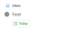
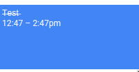
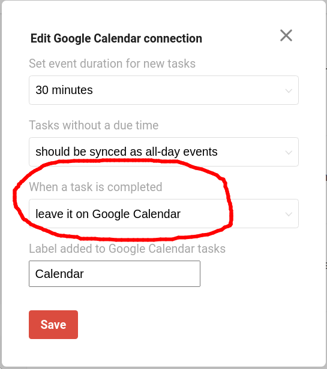

# Done For Todoist
Automatically ~~strikethrough~~ Google Calendar events when their marked completed in Todoist

Original repo including piplines can be [found here](https://gitlab.com/rosenpin/done-for-todoist)  
Website can be [found here](https://done.rosenpin.io)  

## Setup & Usage
### Pre-requirements
1. [Add Google Calendar integration to your Todoist account](https://get.todoist.help/hc/en-us/articles/115003128085-Use-Google-Calendar-with-Todoist)
2. [In the Google Calendar integration, choose "leave it on Google Calendar" in the When a task is completed option](https://todoist.com/prefs/integrations)

### Setup
1. Go to https://done.rosenpin.io
2. Sign in with Todoist
3. Create a task in Todoist and save it (a normal task)
4. Mark the task as done
